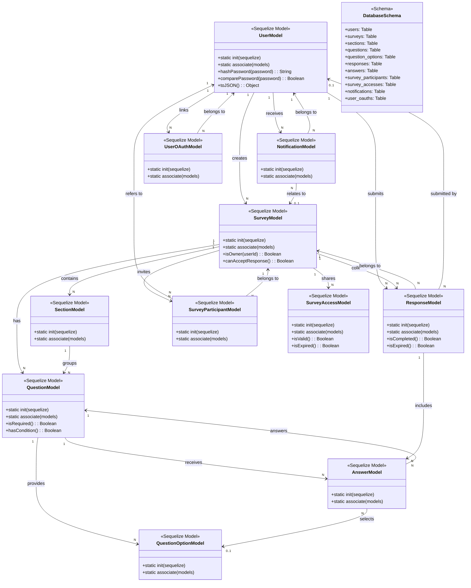
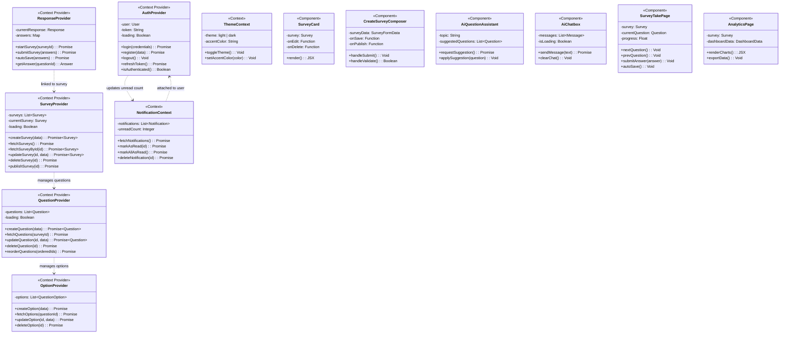

# CHƯƠNG 3. PHÂN TÍCH VÀ THIẾT KẾ HỆ THỐNG

---

## 3.6. Biểu đồ Lớp (Class Diagram)

### 3.6.1. Biểu đồ Lớp tổng hợp hệ thống

```mermaid
classDiagram
    direction TB
    fontSize 14

    %% ============================================================
    %% DOMAIN ENTITIES
    %% ============================================================

    class User {
        <<Entity>>
        -UUID id: String
        -String full_name: String
        -String email: String
        -String password_hash: String
        -String avatar: String
        -Enum role: USER | ADMIN | GUEST
        -Enum gender: MALE | FEMALE | OTHER
        -String phone_number: String
        -Date date_of_birth: Date
        -Boolean is_active: Boolean
        -DateTime created_at: Date
        -DateTime updated_at: Date
        +register() User
        +login() Token
        +updateProfile() User
        +changePassword() Boolean
        +uploadAvatar() String
        +deleteAccount() Boolean
    }

    class Survey {
        <<Entity>>
        -UUID id: String
        -String title: String
        -Text description: Text
        -UUID created_by: String
        -DateTime start_at: Date
        -DateTime end_at: Date
        -Enum access_type: PUBLIC | LINK | PRIVATE | INVITE_ONLY
        -Boolean is_anonymous: Boolean
        -Integer max_responses: Integer
        -Boolean randomize_questions: Boolean
        -Boolean randomize_options: Boolean
        -Integer time_limit_seconds: Integer
        -Boolean show_progress_bar: Boolean
        -Boolean allow_back: Boolean
        -Boolean one_question_per_page: Boolean
        -String thank_you_message: String
        -String thank_you_redirect_url: String
        -String logo_url: String
        -String background_url: String
        -String accent_color: String
        -Boolean show_correct_answers: Boolean
        -Enum status: DRAFT | PUBLISHED | CLOSED | ARCHIVED
        -DateTime created_at: Date
        -DateTime updated_at: Date
        +create() Survey
        +publish() Survey
        +close() Survey
        +update() Survey
        +delete() Boolean
        +share() String
        +invite() Boolean
        +duplicate() Survey
    }

    class Section {
        <<Entity>>
        -UUID id: String
        -UUID survey_id: String
        -String title: String
        -Text description: Text
        -Integer order_index: Integer
        -String icon: String
        -String cover_url: String
        -Integer min_required: Integer
        -Boolean show_progress: Boolean
        -DateTime created_at: Date
        +addQuestion() Question
        +removeQuestion() Boolean
        +reorder() Boolean
    }

    class Question {
        <<Entity>>
        -UUID id: String
        -UUID survey_id: String
        -UUID section_id: String
        -Text content: Text
        -Text description: Text
        -String placeholder: String
        -Enum type: QuestionType
        -Boolean required: Boolean
        -Integer order_index: Integer
        -JSON settings: JSON
        -String media_url: String
        -Enum media_type: IMAGE | VIDEO | AUDIO
        -JSON condition: JSON
        -UUID next_question_id: String
        -UUID next_section_id: String
        -Boolean hidden_from_analytics: Boolean
        -DateTime created_at: Date
        +addOption() QuestionOption
        +update() Question
        +delete() Boolean
        +setCondition() Boolean
        +setMedia() Boolean
    }

    class QuestionOption {
        <<Entity>>
        -UUID id: String
        -UUID question_id: String
        -String label: String
        -String value: String
        -Integer order_index: Integer
        -Boolean is_other: Boolean
        -String image_url: String
        -Enum media_type: IMAGE | VIDEO | AUDIO
        -DateTime created_at: Date
        +update() QuestionOption
        +delete() Boolean
    }

    class Response {
        <<Entity>>
        -UUID id: String
        -UUID survey_id: String
        -UUID user_id: String
        -Enum status: IN_PROGRESS | COMPLETED | ABANDONED
        -DateTime started_at: Date
        -DateTime submitted_at: Date
        -DateTime updated_at: Date
        +start() Response
        +submit() Response
        +saveProgress() Boolean
        +getAnswers() List~Answer~
    }

    class Answer {
        <<Entity>>
        -UUID id: String
        -UUID response_id: String
        -UUID question_id: String
        -UUID option_id: String
        -JSON selected_options: JSON
        -Text answer_text: Text
        -Float answer_number: Float
        -Date answer_date: Date
        -DateTime created_at: Date
        +save() Answer
        +update() Answer
    }

    class SurveyParticipant {
        <<Entity>>
        -UUID id: String
        -UUID survey_id: String
        -UUID user_id: String
        -String email: String
        -Enum role: VIEWER | RESPONDENT | EDITOR
        -DateTime invited_at: Date
        -DateTime responded_at: Date
        +invite() SurveyParticipant
        +remove() Boolean
        +setRole() Boolean
    }

    class SurveyAccess {
        <<Entity>>
        -UUID id: String
        -UUID survey_id: String
        -String access_token: String
        -DateTime expires_at: Date
        -Integer use_count: Integer
        -DateTime created_at: Date
        +generateLink() String
        +validateToken() Boolean
        +revoke() Boolean
    }

    class Notification {
        <<Entity>>
        -UUID id: String
        -UUID user_id: String
        -UUID survey_id: String
        -Enum type: NotificationType
        -String title: String
        -Text message: Text
        -JSON data: JSON
        -Boolean is_read: Boolean
        -DateTime read_at: Date
        -DateTime created_at: Date
        +send() Notification
        +markAsRead() Boolean
        +delete() Boolean
    }

    class UserOAuth {
        <<Entity>>
        -UUID id: String
        -UUID user_id: String
        -String provider: String
        -String provider_uid: String
        -DateTime created_at: Date
        +link() UserOAuth
        +unlink() Boolean
    }

    %% ============================================================
    %% QUESTION TYPES ENUM
    %% ============================================================

    class QuestionType {
        <<Enumeration>>
        TEXT
        PARAGRAPH
        EMAIL
        NUMBER
        PHONE
        DATE
        TIME
        DATETIME
        SINGLE_CHOICE
        MULTIPLE_CHOICE
        DROPDOWN
        RATING
        SCALE
        RANKING
        IMAGE_CHOICE
        YES_NO
        MATRIX
    }

    class NotificationType {
        <<Enumeration>>
        SURVEY_INVITATION
        SURVEY_RESPONSE
        SURVEY_EXPIRED
        SURVEY_PUBLISHED
        SURVEY_CLOSED
        NEW_PARTICIPANT
        SYSTEM_ANNOUNCEMENT
    }

    class SurveyAccessType {
        <<Enumeration>>
        PUBLIC
        LINK
        PRIVATE
        INVITE_ONLY
    }

    class ResponseStatus {
        <<Enumeration>>
        IN_PROGRESS
        COMPLETED
        ABANDONED
    }

    class SurveyStatus {
        <<Enumeration>>
        DRAFT
        PUBLISHED
        CLOSED
        ARCHIVED
    }

    class UserRole {
        <<Enumeration>>
        ADMIN
        USER
        GUEST
    }

    %% ============================================================
    %% RELATIONSHIPS BETWEEN ENTITIES
    %% ============================================================

    User "1" o-- "0..*" Survey : creates
    User "1" o-- "0..*" Response : submits
    User "1" o-- "0..*" Notification : receives
    User "1" o-- "0..*" UserOAuth : authenticates via
    User "1" o-- "0..*" SurveyParticipant : participates as

    Survey "1" o-- "0..*" Section : contains
    Survey "1" o-- "0..*" Question : has
    Survey "1" o-- "0..*" Response : collects
    Survey "1" o-- "0..*" SurveyParticipant : invites
    Survey "1" o-- "0..*" SurveyAccess : shares via

    Section "1" o-- "0..*" Question : groups
    Question "1" o-- "0..*" QuestionOption : provides choices for
    Question "1" o-- "0..*" Answer : receives

    Response "1" o-- "0..*" Answer : consists of
    Response "*" --> "1" Survey : belongs to
    Response "*" --> "0..1" User : submitted by

    SurveyParticipant "*" --> "1" User : refers to
    SurveyParticipant "*" --> "1" Survey : belongs to

    Notification "*" --> "1" User : belongs to
    Notification "*" --> "0..1" Survey : relates to

    UserOAuth "*" --> "1" User : belongs to

    %% ============================================================
    %% TYPE ANNOTATIONS
    %% ============================================================
    Question .. QuestionType : uses
    Survey .. SurveyAccessType : uses
    Survey .. SurveyStatus : uses
    Response .. ResponseStatus : uses
    Notification .. NotificationType : uses
    User .. UserRole : uses
```



---

### 3.6.2. Biểu đồ Lớp - Tầng Điều khiển (Controller Layer)

```mermaid
classDiagram
    direction TB
    fontSize 14

    class BaseController {
        <<Abstract>>
        +handleSuccess(data, message, statusCode)
        +handleError(error, statusCode)
        +handleNotFound(resource)
        +paginate(query, page, limit)
    }

    class AuthController {
        <<Controller>>
        +register(req, res, next)
        +login(req, res, next)
        +verifyEmail(req, res, next)
        +resendVerification(req, res, next)
        +oauthLogin(req, res, next)
        +forgotPassword(req, res, next)
        +verifyResetCode(req, res, next)
        +resetPassword(req, res, next)
        +refreshToken(req, res, next)
        +logout(req, res, next)
    }

    class UserController {
        <<Controller>>
        +getUserInfo(req, res, next)
        +updateUserProfile(req, res, next)
        +updateUserAvatar(req, res, next)
        +getListOfUser(req, res, next)
        +getUserById(req, res, next)
        +deleteUser(req, res, next)
    }

    class SurveyController {
        <<Controller>>
        +createSurvey(req, res, next)
        +getSurveyById(req, res, next)
        +getMySurveys(req, res, next)
        +getPublicSurveys(req, res, next)
        +getInvitedSurveys(req, res, next)
        +updateSurvey(req, res, next)
        +deleteSurvey(req, res, next)
        +publishSurvey(req, res, next)
        +closeSurvey(req, res, next)
        +shareLink(req, res, next)
        +inviteSurvey(req, res, next)
        +bulkInviteSurvey(req, res, next)
        +getParticipants(req, res, next)
        +deleteParticipant(req, res, next)
        +extendDeadline(req, res, next)
    }

    class QuestionController {
        <<Controller>>
        +createQuestion(req, res, next)
        +getQuestionsBySurvey(req, res, next)
        +updateQuestion(req, res, next)
        +deleteQuestion(req, res, next)
        +reorderQuestions(req, res, next)
        +bulkCreateQuestions(req, res, next)
        +suggestQuestions(req, res, next)
    }

    class OptionController {
        <<Controller>>
        +createOption(req, res, next)
        +getOptionsByQuestion(req, res, next)
        +updateOption(req, res, next)
        +deleteOption(req, res, next)
        +bulkCreateOptions(req, res, next)
    }

    class ResponseController {
        <<Controller>>
        +startSurvey(req, res, next)
        +submitSurvey(req, res, next)
        +getAnswers(req, res, next)
        +updateResponse(req, res, next)
        +deleteResponse(req, res, next)
        +autoSave(req, res, next)
        +getMyResponse(req, res, next)
        +getMyResponses(req, res, next)
    }

    class SectionController {
        <<Controller>>
        +createSection(req, res, next)
        +getBySurvey(req, res, next)
        +updateSection(req, res, next)
        +deleteSection(req, res, next)
        +reorderSections(req, res, next)
        +bulkCreateSections(req, res, next)
    }

    class NotificationController {
        <<Controller>>
        +getNotifications(req, res, next)
        +getUnreadCount(req, res, next)
        +markAsRead(req, res, next)
        +markAllAsRead(req, res, next)
        +deleteNotification(req, res, next)
    }

    class AnalyticsController {
        <<Controller>>
        +getDashboard(req, res, next)
        +getSurveyAnalytics(req, res, next)
        +getCompletionStats(req, res, next)
        +getResponseTrend(req, res, next)
        +getIndividualResponses(req, res, next)
        +getQuestionAnalytics(req, res, next)
        +getCrossTab(req, res, next)
        +compareByGender(req, res, next)
        +compareByAge(req, res, next)
        +getDateHeatmap(req, res, next)
        +exportCSV(req, res, next)
    }

    class AIChatController {
        <<Controller>>
        +chat(req, res, next)
    }

    class MediaController {
        <<Controller>>
        +uploadQuestionMedia(req, res, next)
    }

    class AdminStatsController {
        <<Controller>>
        +getOverview(req, res, next)
        +getSurveyByDay(req, res, next)
        +getDashboard(req, res, next)
        +getTotalUsersAnswered(req, res, next)
        +getUsersAnsweredBySurvey(req, res, next)
    }

    BaseController <|-- AuthController
    BaseController <|-- UserController
    BaseController <|-- SurveyController
    BaseController <|-- QuestionController
    BaseController <|-- OptionController
    BaseController <|-- ResponseController
    BaseController <|-- SectionController
    BaseController <|-- NotificationController
    BaseController <|-- AnalyticsController
    BaseController <|-- AIChatController
    BaseController <|-- MediaController
    BaseController <|-- AdminStatsController
```



---

### 3.6.3. Biểu đồ Lớp - Tầng Dịch vụ (Service Layer)

```mermaid
classDiagram
    direction TB
    fontSize 14

    class AuthService {
        <<Service>>
        -db: Sequelize
        -emailService: EmailService
        -jwtService: JWTService
        -bcryptService: BcryptService
        +register(userData): Promise~User~
        +login(credentials): Promise~Token~
        +verifyEmail(userId, code): Promise~Boolean~
        +oauthLogin(provider, providerUid): Promise~Token~
        +refreshToken(token): Promise~Token~
        +forgotPassword(email): Promise~Boolean~
        +resetPassword(userId, code, newPassword): Promise~Boolean~
        +logout(userId): Promise~Boolean~
        -generateVerificationCode(): String
        -sendVerificationEmail(): Promise~Void~
    }

    class UserService {
        <<Service>>
        -db: Sequelize
        -userModel: Model
        +getUserInfo(userId): Promise~User~
        +updateUserProfile(userId, data): Promise~User~
        +updateUserAvatar(userId, fileUrl): Promise~User~
        +getUserById(userId): Promise~User~
        +getListOfUser(filters, pagination): Promise~List~User~~
        +deleteUser(userId): Promise~Boolean~
    }

    class SurveyService {
        <<Service>>
        -db: Sequelize
        -surveyModel: Model
        -userModel: Model
        -participantModel: Model
        -accessModel: Model
        -notificationService: NotificationService
        +createSurvey(userId, data): Promise~Survey~
        +getSurveyById(surveyId, userId?): Promise~Survey~
        +getMySurveys(userId, filters): Promise~List~Survey~~
        +getPublicSurveys(pagination): Promise~List~Survey~~
        +getInvitedSurveys(userId): Promise~List~Survey~~
        +updateSurvey(surveyId, userId, data): Promise~Survey~
        +deleteSurvey(surveyId, userId): Promise~Boolean~
        +publishSurvey(surveyId, userId): Promise~Survey~
        +closeSurvey(surveyId, userId): Promise~Survey~
        +shareLink(surveyId, userId): Promise~String~
        +inviteSurvey(surveyId, emails): Promise~Boolean~
        +bulkInviteSurvey(surveyId, emails): Promise~Boolean~
        +getParticipants(surveyId): Promise~List~Participant~~
        +deleteParticipant(surveyId, participantId): Promise~Boolean~
        +extendDeadline(surveyId, newDate): Promise~Survey~
        -validateOwnership(surveyId, userId): Boolean
        -validateAccess(surveyId, userId): Boolean
    }

    class QuestionService {
        <<Service>>
        -db: Sequelize
        -questionModel: Model
        -optionModel: Model
        +createQuestion(surveyId, data): Promise~Question~
        +getQuestionsBySurvey(surveyId): Promise~List~Question~~
        +updateQuestion(questionId, surveyId, data): Promise~Question~
        +deleteQuestion(questionId, surveyId): Promise~Boolean~
        +reorderQuestions(surveyId, orderedIds): Promise~Boolean~
        +bulkCreateQuestions(surveyId, questions): Promise~List~Question~~
        +setCondition(questionId, condition): Promise~Question~
    }

    class OptionService {
        <<Service>>
        -db: Sequelize
        -optionModel: Model
        +createOption(questionId, data): Promise~QuestionOption~
        +getOptionsByQuestion(questionId): Promise~List~QuestionOption~~
        +updateOption(optionId, data): Promise~QuestionOption~
        +deleteOption(optionId): Promise~Boolean~
        +bulkCreateOptions(questionId, options): Promise~List~QuestionOption~~
    }

    class ResponseService {
        <<Service>>
        -db: Sequelize
        -responseModel: Model
        -answerModel: Model
        -surveyModel: Model
        -notificationService: NotificationService
        +startSurvey(surveyId, userId?, metadata?): Promise~Response~
        +submitSurvey(responseId, answers): Promise~Response~
        +updateResponse(responseId, answers): Promise~Response~
        +deleteResponse(responseId): Promise~Boolean~
        +autoSave(responseId, answers): Promise~Boolean~
        +getAllResponsesByUserId(userId): Promise~List~Response~~
        +getSurveySubmitByUserId(surveyId, userId): Promise~Response~
        -validateSurveyAccess(surveyId): Boolean
        -validateAnswers(answers, questions): Boolean
    }

    class SectionService {
        <<Service>>
        -db: Sequelize
        -sectionModel: Model
        +createSection(surveyId, data): Promise~Section~
        +getSectionsBySurvey(surveyId): Promise~List~Section~~
        +updateSection(sectionId, data): Promise~Section~
        +deleteSection(sectionId): Promise~Boolean~
        +reorderSections(surveyId, orderedIds): Promise~Boolean~
        +bulkCreateSections(surveyId, sections): Promise~List~Section~~
    }

    class NotificationService {
        <<Service>>
        -notificationModel: Model
        -emailService: EmailService
        +createNotification(userId, data): Promise~Notification~
        +notifySurveyResponse(surveyOwnerId, response): Promise~Void~
        +notifySurveyInvitation(userId, survey): Promise~Void~
        +notifyNewParticipant(surveyOwnerId, participant): Promise~Void~
        +notifySurveyExpired(surveyOwnerId, survey): Promise~Void~
        +notifySurveyPublished(surveyOwnerId, survey): Promise~Void~
        +notifySurveyClosed(surveyOwnerId, survey): Promise~Void~
        +getNotifications(userId, filters): Promise~List~Notification~~
        +markAsRead(notificationId): Promise~Boolean~
        +markAllAsRead(userId): Promise~Boolean~
    }

    class SurveyAnalyticsService {
        <<Service>>
        -db: Sequelize
        -surveyModel: Model
        -responseModel: Model
        -answerModel: Model
        -questionModel: Model
        -userModel: Model
        +getDashboard(surveyId): Promise~DashboardData~
        +getCompletionStats(surveyId): Promise~CompletionStats~
        +getResponseTrend(surveyId, period): Promise~TrendData~
        +getIndividualResponses(surveyId, filters): Promise~List~Response~~
        +getQuestionAnalytics(questionId, filters): Promise~QuestionStats~
        +getCrossTab(surveyId, q1Id, q2Id): Promise~CrossTabData~
        +compareByGender(questionId): Promise~GenderData~
        +compareByAge(questionId): Promise~AgeData~
        +getDateHeatmap(surveyId): Promise~HeatmapData~
        +exportCSV(surveyId, filters): Promise~String~
        -calculateCompletionRate(): Float
        -aggregateAnswers(questionId): Object
        -buildDemographics(responses): Demographics
    }

    class AIChatService {
        <<Service>>
        -geminiApi: GeminiAPI
        +chat(message, surveyContext?, history?): Promise~AIResponse~
        +suggestQuestions(topic, count, types): Promise~List~Question~~
        -buildContext(surveyContext): String
        -handleFunctionCall(functionName, args): Promise~Object~
    }

    %% Dependency relationships
    SurveyService ..> NotificationService : uses
    ResponseService ..> NotificationService : uses
    AuthController ..> AuthService : calls
    UserController ..> UserService : calls
    SurveyController ..> SurveyService : calls
    QuestionController ..> QuestionService : calls
    OptionController ..> OptionService : calls
    ResponseController ..> ResponseService : calls
    SectionController ..> SectionService : calls
    NotificationController ..> NotificationService : calls
    AnalyticsController ..> SurveyAnalyticsService : calls
    AIChatController ..> AIChatService : calls
```



---

### 3.6.4. Biểu đồ Lớp - Tầng Middleware

```mermaid
classDiagram
    direction TB
    fontSize 14

    class AuthMiddleware {
        <<Middleware>>
        +verifyToken(req, res, next): Void
        +verifyRefreshToken(req, res, next): Void
        +requireRole(...roles)(req, res, next): Void
        +requireSurveyAccess(req, res, next): Void
        +requireSurveyOwner(req, res, next): Void
        +requireAdmin(req, res, next): Void
        -decodeToken(token): Object
        -blacklistToken(token): Void
    }

    class ValidateMiddleware {
        <<Middleware>>
        +validate(schema)(req, res, next): Void
        +validateParams(schema)(req, res, next): Void
        +validateBody(schema)(req, res, next): Void
        +validateQuery(schema)(req, res, next): Void
        -buildErrorMessage(errors): String
    }

    class MulterMiddleware {
        <<Middleware>>
        +upload.single(fieldname)(req, res, next): Void
        +upload.array(fieldname, maxCount)(req, res, next): Void
        +uploadMiddleware(req, res, next): Void
        -filterFile(mimetype): Boolean
        -handleUploadError(err, req, res, next): Void
    }

    class HandleExceptionMiddleware {
        <<Middleware>>
        +handle(err, req, res, next): Void
        +notFound(req, res, next): Void
        +isOperational(err): Boolean
        -formatError(err): ErrorResponse
        -logError(err): Void
    }

    class RateLimitMiddleware {
        <<Middleware>>
        +limit(req, res, next): Void
        -checkQuota(ip): Boolean
        -incrementQuota(ip): Void
    }

    class CorsMiddleware {
        <<Middleware>>
        +handle(req, res, next): Void
        -validateOrigin(origin): Boolean
    }
```



---

### 3.6.5. Biểu đồ Lớp - Tầng Cơ sở Dữ liệu (Database Model)



---

### 3.6.6. Biểu đồ Lớp - Tầng Frontend (React Components)



---

### 3.6.7. Mô tả chi tiết các lớp trong hệ thống

#### 3.6.7.1. Các lớp Entity (Domain)

| Lớp | Mô tả | Thuộc tính chính | Phương thức chính |
|------|--------|------------------|-------------------|
| **User** | Người dùng hệ thống | id, full_name, email, password_hash, role, avatar | register(), login(), updateProfile(), changePassword() |
| **Survey** | Khảo sát | id, title, description, status, access_type, settings | create(), publish(), close(), share(), invite() |
| **Section** | Phần/Nhóm câu hỏi | id, survey_id, title, order_index | addQuestion(), removeQuestion(), reorder() |
| **Question** | Câu hỏi | id, content, type, required, settings, condition | addOption(), update(), delete(), setCondition() |
| **QuestionOption** | Tùy chọn câu hỏi | id, question_id, label, value, order_index | update(), delete() |
| **Response** | Lượt trả lời | id, survey_id, user_id, status | start(), submit(), saveProgress(), getAnswers() |
| **Answer** | Câu trả lời | id, response_id, question_id, answer_text, option_id | save(), update() |
| **SurveyParticipant** | Người tham gia khảo sát | id, survey_id, user_id, email, role | invite(), remove(), setRole() |
| **SurveyAccess** | Liên kết chia sẻ | id, survey_id, access_token, expires_at | generateLink(), validateToken(), revoke() |
| **Notification** | Thông báo | id, user_id, type, title, message, is_read | send(), markAsRead(), delete() |
| **UserOAuth** | Tài khoản OAuth | id, user_id, provider, provider_uid | link(), unlink() |

#### 3.6.7.2. Các lớp Enumeration

| Enumeration | Giá trị | Mô tả |
|-------------|---------|--------|
| **QuestionType** | TEXT, PARAGRAPH, EMAIL, NUMBER, PHONE, DATE, TIME, DATETIME, SINGLE_CHOICE, MULTIPLE_CHOICE, DROPDOWN, RATING, SCALE, RANKING, IMAGE_CHOICE, YES_NO, MATRIX | 17 loại câu hỏi được hỗ trợ |
| **SurveyAccessType** | PUBLIC, LINK, PRIVATE, INVITE_ONLY | 4 kiểu quyền truy cập |
| **SurveyStatus** | DRAFT, PUBLISHED, CLOSED, ARCHIVED | 4 trạng thái khảo sát |
| **ResponseStatus** | IN_PROGRESS, COMPLETED, ABANDONED | 3 trạng thái lượt trả lời |
| **NotificationType** | SURVEY_INVITATION, SURVEY_RESPONSE, SURVEY_EXPIRED, SURVEY_PUBLISHED, SURVEY_CLOSED, NEW_PARTICIPANT, SYSTEM_ANNOUNCEMENT | 7 loại thông báo |
| **UserRole** | ADMIN, USER, GUEST | 3 vai trò người dùng |

#### 3.6.7.3. Các lớp Controller

| Controller | Số phương thức | Trách nhiệm |
|------------|---------------|------------|
| **AuthController** | 10 | Xác thực, đăng ký, đăng nhập, OAuth, quên mật khẩu |
| **UserController** | 6 | Quản lý hồ sơ, avatar, danh sách user |
| **SurveyController** | 16 | CRUD khảo sát, publish, close, share, invite |
| **QuestionController** | 7 | CRUD câu hỏi, sắp xếp, gợi ý AI |
| **OptionController** | 5 | CRUD tùy chọn câu hỏi |
| **ResponseController** | 8 | Bắt đầu, nộp, autoSave, lấy kết quả |
| **SectionController** | 6 | CRUD phần khảo sát |
| **NotificationController** | 5 | Đọc, đánh dấu đã đọc, xóa thông báo |
| **AnalyticsController** | 11 | Dashboard, biểu đồ, xuất CSV |
| **AIChatController** | 1 | Chat AI |
| **MediaController** | 1 | Upload media |
| **AdminStatsController** | 5 | Thống kê admin |

#### 3.6.7.4. Các lớp Service

| Service | Trách nhiệm | Dependencies |
|---------|------------|-------------|
| **AuthService** | Logic xác thực: hash, JWT, email | bcrypt, jsonwebtoken, nodemailer |
| **UserService** | Logic nghiệp vụ user | userModel |
| **SurveyService** | Logic khảo sát: CRUD, publish, invite | surveyModel, participantModel, notificationService |
| **QuestionService** | Logic câu hỏi | questionModel, optionModel |
| **OptionService** | Logic tùy chọn | optionModel |
| **ResponseService** | Logic trả lời: start, submit, autosave | responseModel, answerModel, notificationService |
| **SectionService** | Logic phần khảo sát | sectionModel |
| **NotificationService** | Logic thông báo: gửi, đọc | notificationModel, emailService |
| **SurveyAnalyticsService** | Phân tích: thống kê, trend, crosstab | surveyModel, responseModel, answerModel, userModel |
| **AIChatService** | Chat AI: Gemini function calling | geminiApi |

#### 3.6.7.5. Các lớp Middleware

| Middleware | Chức năng |
|-----------|-----------|
| **AuthMiddleware** | Xác thực JWT, kiểm tra role, kiểm tra quyền sở hữu khảo sát |
| **ValidateMiddleware** | Validate request body, params, query dùng Joi schema |
| **MulterMiddleware** | Upload file (Cloudinary cho hình ảnh khảo sát) |
| **HandleExceptionMiddleware** | Bắt và format lỗi toàn cục |
| **RateLimitMiddleware** | Giới hạn số request |
| **CorsMiddleware** | CORS configuration |

#### 3.6.7.6. Các lớp Frontend (React Context)

| Context/Provider | Trạng thái quản lý |
|----------------|-------------------|
| **AuthProvider** | user, token, loading, login(), logout() |
| **SurveyProvider** | surveys, currentSurvey, CRUD operations |
| **QuestionProvider** | questions, CRUD operations |
| **OptionProvider** | options, CRUD operations |
| **ResponseProvider** | currentResponse, answers, autoSave |
| **NotificationContext** | notifications, unreadCount |
| **ThemeContext** | theme, accentColor |

---

### 3.6.8. Quan hệ giữa các lớp

```
┌──────────────────────────────────────────────────────────────────┐
│                         MỐI QUAN HỆ HỆ THỐNG                     │
├──────────────────────────────────────────────────────────────────┤
│  1. Association (Quan hệ kết hợp)                                │
│     User ───1:N───► Survey    : Một User tạo nhiều Survey        │
│     User ───1:N───► Response  : Một User nộp nhiều Response       │
│     User ───1:N───► Notification : Một User nhận nhiều Notif     │
│     Survey ───1:N───► Section : Một Survey có nhiều Section      │
│     Survey ───1:N───► Question : Một Survey có nhiều Question    │
│     Survey ───1:N───► Response : Một Survey nhận nhiều Response   │
│     Question ───1:N───► QuestionOption : Một Question có nhiều  │
│     Response ───1:N───► Answer : Một Response có nhiều Answer   │
│                                                                  │
│  2. Composition (Quan hệ thành phần)                            │
│     Survey ●──── Section ●──── Question ●──── QuestionOption     │
│     Survey ●──── Response ●──── Answer                            │
│                                                                  │
│  3. Dependency (Quan hệ phụ thuộc)                             │
│     Controller ──► Service ──► Model                             │
│     Service ──► Service (NotificationService)                   │
│     Middleware ──► Controller                                    │
│                                                                  │
│  4. Realization (Quan hệ thực hiện)                            │
│     BaseController ◁── AuthController                           │
│     BaseController ◁── SurveyController                          │
└──────────────────────────────────────────────────────────────────┘
```

---

### 3.6.9. Kiến trúc tổng thể hệ thống

```
┌─────────────────────────────────────────────────────────────────┐
│                      KIẾN TRÚC PHÂN LỚP HỆ THỐNG                │
├─────────────────────────────────────────────────────────────────┤
│                                                                  │
│   ┌─────────────── CLIENT LAYER ───────────────┐               │
│   │  React SPA (Frontend)   │  React Native (Mobile) │         │
│   │  - Pages               │  - Screens            │          │
│   │  - Components          │  - Components         │          │
│   │  - Context Providers   │  - Navigation          │          │
│   │  - Services (API)      │  - Services (API)      │          │
│   └──────────────────────┬───────────────────────┘              │
│                          │ HTTP / HTTPS                          │
│   ┌──────────────────────┴───────────────────────┐             │
│   │            API GATEWAY / LOAD BALANCER        │             │
│   └──────────────────────┬───────────────────────┘             │
│                          │                                      │
│   ┌──────────────────────┴───────────────────────┐             │
│   │              BACKEND (Node.js + Express)      │             │
│   │                                              │             │
│   │  ┌────────── ROUTE LAYER ──────────┐       │             │
│   │  │ Auth │ Survey │ Response │ ...   │       │             │
│   │  └──────────┬─────────────────────┘       │             │
│   │              │                               │             │
│   │  ┌──────────┴─────────────────────┐       │             │
│   │  │       CONTROLLER LAYER          │       │             │
│   │  │ Auth │ Survey │ Response │ ...  │       │             │
│   │  └──────────┬─────────────────────┘       │             │
│   │              │                               │             │
│   │  ┌──────────┴─────────────────────┐       │             │
│   │  │         SERVICE LAYER            │       │             │
│   │  │ Auth │ Survey │ Response │ ...   │       │             │
│   │  └──────────┬─────────────────────┘       │             │
│   │              │                               │             │
│   │  ┌──────────┴─────────────────────┐       │             │
│   │  │         MODEL LAYER (ORM)       │       │             │
│   │  │    Sequelize ORM + MySQL        │       │             │
│   │  └───────────────────────────────┘       │             │
│   └──────────────────────┬───────────────────┘             │
│                          │                                      │
│   ┌──────────────────────┴───────────────────────┐            │
│   │            DATABASE LAYER                     │            │
│   │  ┌─────────┐  ┌─────────┐  ┌────────────┐  │            │
│   │  │  MySQL  │  │Redis    │  │Cloudinary  │  │            │
│   │  │(Data)   │  │(Cache)  │  │ (Media)    │  │            │
│   │  └─────────┘  └─────────┘  └────────────┘  │            │
│   └─────────────────────────────────────────────┘            │
└─────────────────────────────────────────────────────────────────┘
```

---

## 3.7. Biểu đồ Lớp - Hệ thống Gamification (Mini Game)

### 3.7.1. Biểu đồ Lớp tổng hợp Gamification

```mermaid
classDiagram
    direction TB
    fontSize 14

    %% ============================================================
    %% ENUMERATIONS
    %% ============================================================

    class TransactionType {
        <<Enumeration>>
        DAILY_CHECKIN
        CREATE_SURVEY
        RESPOND_SURVEY
        FIRST_RESPONDER
        SECOND_RESPONDER
        THIRD_RESPONDER
        LATER_RESPONDER
        SURVEY_CREATOR_BONUS
        STREAK_BONUS
        ACHIEVEMENT_REWARD
        RANK_UP_BONUS
        PENALTY
        ADMIN_ADJUST
    }

    class AchievementCategory {
        <<Enumeration>>
        STREAK
        SURVEY_CREATION
        PARTICIPATION
        SOCIAL
        SPECIAL
        RANK
    }

    class AchievementTier {
        <<Enumeration>>
        BRONZE
        SILVER
        GOLD
        PLATINUM
        DIAMOND
    }

    class LeaderboardPeriod {
        <<Enumeration>>
        WEEKLY
        MONTHLY
        ALL_TIME
    }

    %% ============================================================
    %% ENTITIES
    %% ============================================================

    class StarTransaction {
        <<Entity>>
        -UUID id
        -UUID user_id
        -Integer amount
        -Enum type: TransactionType
        -String description
        -JSON metadata
        -Integer balance_after
        -UUID ref_id
        -String ref_type
        -Boolean is_reversed
        -DateTime created_at
        +create() StarTransaction
        +reverse() Boolean
    }

    class Achievement {
        <<Entity>>
        -UUID id
        -String code
        -String name
        -Text description
        -String icon
        -Enum category: AchievementCategory
        -Integer star_reward
        -Enum tier: AchievementTier
        -String condition_type
        -Integer condition_value
        -Boolean is_active
        +checkAndUnlock() List~UserAchievement~
        +seedAchievements() List~Achievement~
    }

    class UserAchievement {
        <<Entity>>
        -UUID id
        -UUID user_id
        -UUID achievement_id
        -Integer progress
        -Boolean is_unlocked
        -DateTime unlocked_at
        -Boolean notification_sent
        +unlock() UserAchievement
        +updateProgress() Boolean
    }

    class DailyCheckin {
        <<Entity>>
        -UUID id
        -UUID user_id
        -Date checkin_date
        -Integer stars_earned
        -Integer streak_count
        -Decimal multiplier
        -String ip_address
        -String device_info
        +checkin() CheckinResult
        +hasCheckedInToday() Boolean
    }

    class Rank {
        <<Entity>>
        -UUID id
        -String name
        -String icon
        -String color
        -Integer min_stars
        -Integer max_stars
        -Decimal bonus_multiplier
        -String description
        -Integer order_index
        -Boolean is_active
    }

    class User~Gamification {
        <<Entity>>
        -UUID id
        -Integer star_balance
        -Integer total_stars_earned
        -String current_rank
        -Integer streak_count
        -Date last_checkin_date
        -Integer highest_streak
        -Integer weekly_stars
        -Integer monthly_stars
        +addStars() StarResult
        +deductStars() StarResult
        +getBalance() Balance
        +getRankInfo() RankInfo
    }

    class StarService {
        <<Service>>
        +addStars() StarResult
        +deductStars() StarResult
        +reverseTransaction() Boolean
        +rewardCreateSurvey() StarResult
        +rewardSubmitSurvey() StarResult
        +rewardCreatorForRespondent() StarResult
        +rewardDailyCheckin() StarResult
        +rewardAchievement() StarResult
        +getBalance() Balance
        +getRankInfo() RankInfo
    }

    class DailyCheckinService {
        <<Service>>
        +checkin() CheckinResult
        +hasCheckedInToday() Status
        +getHistory() List~DailyCheckin~
        +getCurrentStreak() StreakInfo
    }

    class AchievementService {
        <<Service>>
        +seedAchievements() List~Achievement~
        +checkAndUnlock() List~Achievement~
        +getUserAchievements() AchievementData
        +getRecentUnlocks() List~Achievement~
    }

    class LeaderboardService {
        <<Service>>
        +getLeaderboard() List~LeaderboardEntry~
        +getUserRank() RankInfo
        +getTop5WithPrizes() List~PrizeEntry~
        +getUserComparison() ComparisonData
        +resetWeeklyStars() Boolean
        +resetMonthlyStars() Boolean
        +updatePeriodicStars() Boolean
    }

    class StarController {
        <<Controller>>
        +getBalance()
        +getTransactionHistory()
        +getRankInfo()
        +adminAdjustStars()
    }

    class DailyCheckinController {
        <<Controller>>
        +checkin()
        +getCheckinStatus()
        +getHistory()
        +getCurrentStreak()
    }

    class AchievementController {
        <<Controller>>
        +getUserAchievements()
        +getRecentUnlocks()
        +seedAchievements()
    }

    class LeaderboardController {
        <<Controller>>
        +getLeaderboard()
        +getUserRank()
        +getTop5WithPrizes()
        +getUserComparison()
        +adminResetWeekly()
        +adminResetMonthly()
    }

    %% ============================================================
    %% RELATIONSHIPS
    %% ============================================================

    StarTransaction "N" --> "1" User~Gamification : belongs to
    User~Gamification "1" o-- "0..*" DailyCheckin : checks in daily
    User~Gamification "1" o-- "0..*" StarTransaction : earns stars
    User~Gamification "1" o-- "0..*" UserAchievement : unlocks achievements

    Achievement "1" o-- "0..*" UserAchievement : unlocked by users
    UserAchievement "N" --> "1" User~Gamification : belongs to

    StarService ..> StarTransaction : creates
    StarService ..> User~Gamification : updates balance
    DailyCheckinService ..> StarService : calls to add stars
    DailyCheckinService ..> DailyCheckin : creates records
    AchievementService ..> UserAchievement : creates records
    AchievementService ..> StarService : calls to reward
    LeaderboardService ..> User~Gamification : reads ranks

    StarController ..> StarService : calls
    DailyCheckinController ..> DailyCheckinService : calls
    AchievementController ..> AchievementService : calls
    LeaderboardController ..> LeaderboardService : calls

    StarTransaction .. TransactionType : uses
    Achievement .. AchievementCategory : uses
    Achievement .. AchievementTier : uses
    LeaderboardService .. LeaderboardPeriod : uses
```

---

### 3.7.2. Mô tả chi tiết các lớp Gamification

#### 3.7.2.1. Các lớp Entity

| Lớp | Mô tả | Thuộc tính chính | Phương thức chính |
|------|--------|------------------|-------------------|
| **StarTransaction** | Lịch sử giao dịch sao | id, user_id, amount, type, balance_after, is_reversed | create(), reverse() |
| **Achievement** | Định nghĩa huy hiệu | code, name, icon, category, star_reward, tier, condition | checkAndUnlock(), seedAchievements() |
| **UserAchievement** | Huy hiệu của user | user_id, achievement_id, progress, is_unlocked, unlocked_at | unlock(), updateProgress() |
| **DailyCheckin** | Bản ghi điểm danh | user_id, checkin_date, stars_earned, streak_count, multiplier | checkin(), hasCheckedInToday() |
| **Rank** | Cấp bậc (Bronze → Diamond) | name, min_stars, max_stars, bonus_multiplier, icon, color | - |

#### 3.7.2.2. Bảng cấu hình sao

| Hành động | Số sao |
|-----------|--------|
| Điểm danh hằng ngày | +50–100 sao (base 50 × multiplier) |
| Tạo khảo sát | +50 sao |
| Người tham gia #1 | +100 sao |
| Người tham gia #2 | +50 sao |
| Người tham gia #3 | +30 sao |
| Người tham gia #4+ | +20 sao |
| Người tạo nhận bonus/người | +10 sao/người |
| Huy hiệu (tùy loại) | +15–500 sao |

#### 3.7.2.3. Bảng cấu hình Rank

| Rank | Icon | Màu | Min sao | Max sao | Bonus |
|------|------|------|---------|---------|-------|
| Bronze 🥉 | 🥉 | #CD7F32 | 0 | 499 | x1.0 |
| Silver 🥈 | 🥈 | #C0C0C0 | 500 | 1999 | x1.1 |
| Gold 🥇 | 🥇 | #FFD700 | 2000 | 4999 | x1.2 |
| Platinum 💎 | 💎 | #E5E4E2 | 5000 | 9999 | x1.3 |
| Diamond 💠 | 💠 | #B9F2FF | 10000+ | ∞ | x1.5 |

#### 3.7.2.4. Bảng cấu hình phần thưởng Leaderboard (Top 5 tuần)

| Rank | Phần thưởng |
|------|------------|
| 🥇 Top 1 | Thẻ điện thoại **500.000đ** |
| 🥈 Top 2 | Thẻ điện thoại **300.000đ** |
| 🥉 Top 3 | Thẻ điện thoại **150.000đ** |
| 4️⃣ Top 4 | Thẻ điện thoại **70.000đ** |
| 5️⃣ Top 5 | Thẻ điện thoại **30.000đ** |

#### 3.7.2.5. Bảng mô tả Achievement

| Code | Tên | Danh mục | Tier | Điều kiện | Sao thưởng |
|------|------|---------|------|-----------|-----------|
| STREAK_3 | Kiên trì | STREAK | Bronze | 3 ngày liên tiếp | +15 |
| STREAK_7 | Cam kết | STREAK | Silver | 7 ngày liên tiếp | +40 |
| FIRST_SURVEY | Người mới | SURVEY_CREATION | Bronze | 1 survey | +20 |
| FIVE_SURVEYS | Khảo sát viên | SURVEY_CREATION | Silver | 5 surveys | +50 |
| TEN_SURVEYS | Chuyên gia | SURVEY_CREATION | Gold | 10 surveys | +100 |
| FIRST_RESPONSE | Người tham gia | PARTICIPATION | Bronze | 1 response | +20 |
| VIRAL_SURVEY | Khảo sát viral | SOCIAL | Gold | 100 responders | +200 |
| RANK_GOLD | Vàng rực rỡ | RANK | Gold | 2000 sao tổng | +100 |
| RANK_DIAMOND | Kim cương | RANK | Diamond | 10000 sao tổng | +500 |

#### 3.7.2.6. Kiến trúc Gamification tổng thể

```
┌──────────────────────────────────────────────────────────────┐
│                    GAMIFICATION FLOW                           │
├──────────────────────────────────────────────────────────────┤
│                                                               │
│  ┌──────────────┐       ┌──────────────────────┐           │
│  │ Survey       │       │ Response             │           │
│  │ Service      │       │ Service              │           │
│  │ (create)     │       │ (submit)             │           │
│  └──────┬───────┘       └──────┬───────────────┘           │
│         │                       │                             │
│         ▼                       ▼                             │
│  ┌─────────────────────────────────────────────┐           │
│  │              STAR SERVICE                     │           │
│  │  • addStars()  • rewardCreateSurvey()       │           │
│  │  • deductStars() • rewardSubmitSurvey()     │           │
│  │  • rewardDailyCheckin()                    │           │
│  │  • rewardAchievement()                     │           │
│  └──────┬────────────────────┬─────────────────┘           │
│         │                    │                             │
│         ▼                    ▼                             │
│  ┌─────────────┐   ┌──────────────────┐                  │
│  │ StarTrans-  │   │ User Model       │                  │
│  │ action      │   │ (star_balance,   │                  │
│  │ (log)       │   │  current_rank,   │                  │
│  └─────────────┘   │  weekly_stars,   │                  │
│                    │  monthly_stars,   │                  │
│                    │  streak_count)    │                  │
│                    └────────┬─────────┘                  │
│                             │                             │
│         ┌──────────────────┼──────────────────┐           │
│         ▼                  ▼                  ▼           │
│  ┌──────────────┐  ┌──────────────┐  ┌──────────────┐   │
│  │ Achievement  │  │ Leaderboard │  │DailyCheckin │   │
│  │ Service     │  │ Service     │  │Service     │   │
│  │(check&unlock)│  │(getTop5)   │  │(streak)    │   │
│  └──────────────┘  └──────────────┘  └──────────────┘   │
│                                                               │
└───────────────────────────────────────────────────────────────┘
```
